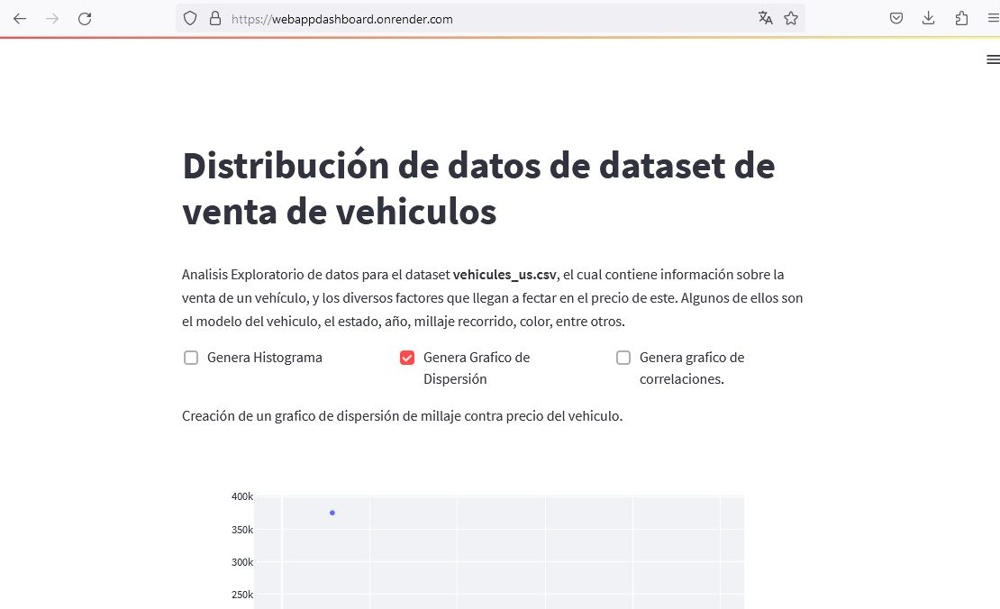

# Dashboard para el analisis de la venta de vehiculos.
El presente proyecto muestra una aplicación web que tiene como finalidad mostrar el Analisis Exploratorio de datos para el dataset __vehicules_us.csv__, el cual contiene información sobre la venta de un vehículos, y los diversos factores que llegan a fectar en el precio de este. Algunos de ellos son el modelo del vehiculo, el estado, año, millaje recorrido, color, entre otros. 

 
The present project shows a web application aimed at displaying Exploratory Data Analysis for the dataset __vehicles_us.csv__, which contains information about vehicle sales and the various factors that affect their price. Some of these factors include the vehicle model, condition, year, mileage, color, among others.

 

> :memo: **Link:** Se puede acceder al sitio mediante la siguiente liga: [Python Dashboard](https://webappdashboard.onrender.com/).

 

